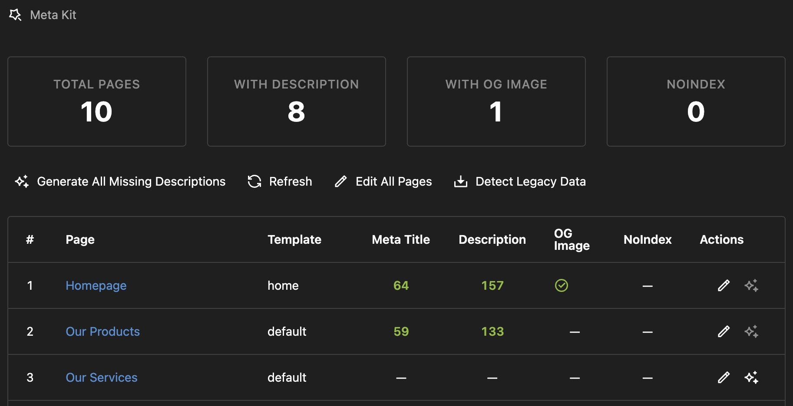

# Kirby Meta Kit

An SEO workflow plugin for Kirby CMS with AI-assisted content generation, experimental content review, validation, previews, and centralized metadata management.

[](https://github.com/tearoom1/kirby-meta-kit)

## Why Meta Kit?

### For Content Editors
- **Single Point of Overview**: Meta Kit provides a unified interface for managing metadata, making it easier to keep track of your SEO efforts
- **Clear Guidelines**: Visual validation shows exactly what's optimal (green), acceptable (orange), or needs fixing (red)
- **AI Assistant**: Generate SEO-optimized content with one click, automatically matching your configured character limits
- **Preview Support**: Review Google and social preview output directly in the Panel
- **Bulk Operations**: Edit metadata for multiple pages simultaneously with an efficient table interface
- **Template-Specific Rules**: Different page types can have different SEO requirements (blog posts vs. product pages)

### For Developers & Agencies
- **Enforce Standards**: Set validation ranges globally or per template to ensure consistent SEO quality
- **Client-Friendly**: Editors get immediate feedback without needing SEO expertise
- **AI Integration**: Uses OpenRouter (free tier available) for cost-effective AI generation
- **Time-Saving**: Bulk edit hundreds of pages
- **Complete Solution**: Meta tags, Schema.org, sitemap, robots.txt - everything in one plugin

### Key Advantages

1. **Smart Validation System**
   - Set character length rules for titles and descriptions
   - Configure different rules per page template (e.g., articles vs. products)
   - Visual feedback: green (optimal), orange (acceptable), red (fix needed)
   - Accounts for site name appending in title length calculations

2. **AI That Follows Your Rules**
   - AI-generated content automatically matches your validation ranges
   - Template-specific: AI knows that articles need longer titles than product pages
   - Site name aware: Automatically adjusts title length when site name will be appended
   - Multilingual: Generates content in the current language with appropriate formality

3. **Professional Panel Interface**
   - Dedicated Meta Kit area in main menu with action-focused dashboard cards
   - Bulk editor: Review multiple pages in one table and edit them in focused dialogs
   - Real-time character counters with validation feedback
   - Slug validation: Check URL structure, depth, and keyword usage

4. **Complete SEO Coverage**
   - Meta tags (title, description, robots, canonical)
   - OpenGraph & Twitter Cards with optimized images
   - Schema.org JSON-LD structured data
   - XML sitemap with visual configuration
   - Dynamic robots.txt with bot blocking

---

## Features

- 🎯 **Smart Validation** - Template-specific character limits with visual feedback
- 🤖 **AI Generation** - Auto-generates SEO content matching your validation rules
- 🧪 **AI Content Review** - Experimental page review with keyphrase suggestions and editorial feedback
- 🎛️ **Panel Dashboard** - Dedicated area for metadata management with action-focused stats
- 👁️ **Live Previews** - See Google, Twitter, Facebook appearance in real-time
- ⚡ **Bulk Operations** - Edit multiple pages simultaneously
- 📊 **Slug Validation** - Checks URL depth, word count, and length
- 🗺️ **Sitemap** - Styled XML with multilanguage & priority support
- 🤖 **Robots.txt** - Dynamic generation with bad bot blocking
- 🏗️ **Schema.org** - JSON-LD structured data
- 📱 **Social Media** - OpenGraph & Twitter Cards (1200×630px)
- 🌍 **Multilanguage** - Full support with hreflang tags
- ⚡ **Kirby 5** - Fully compatible with latest version

---

## Installation

### Via Composer (Recommended)

```bash
composer require tearoom1/kirby-meta-kit
```

### Manual Installation

1. Download and extract to `site/plugins/meta-kit`
2. Get a free API key from [OpenRouter.ai](https://openrouter.ai/) (optional, for AI features)

---

## Quick Start

### 1. Add SEO Snippet

Add this single line to your template's `<head>` section:

```php
<head>
    <?php snippet('meta-kit/seo') ?>
    <!-- Your other head content -->
</head>
```

This snippet automatically includes:
- All meta tags (title, description, robots, canonical, keywords)
- OpenGraph and Twitter Card tags
- Schema.org JSON-LD structured data
- Hreflang tags for multilingual sites

### 2. Extend Blueprints

**Site Settings** (`site/blueprints/site.yml`):
```yaml
tabs:
  seo:
    extends: meta-kit/site
```

**Page SEO** (`site/blueprints/pages/default.yml`):
```yaml
tabs:
  seo:
    extends: meta-kit/page
```

### 3. Configure Basic Settings

Add to `site/config/config.php`:

```php
return [
    'tearoom1.meta-kit' => [
        // Optional: Add AI features
        'api.key' => 'sk-or-v1-YOUR-KEY',
        'api.model' => 'google/gemma-4-31b-it:free',
    ]
];
```

That's it! You now have:
- ✅ SEO metadata fields in your pages
- ✅ Site-wide SEO settings
- ✅ Automatic sitemap at `/sitemap.xml`
- ✅ Dynamic robots.txt at `/robots.txt`
- ✅ (Optional) AI-powered content generation

---

## Configuration

Meta Kit uses a two-layer configuration system for maximum flexibility:

### Layer 1: Config File (Technical Settings)

**Location**: `site/config/config.php`

This is where developers set technical defaults, validation rules, and AI integration.

```php
'tearoom1.meta-kit' => [
    // ====================================
    // ACCESS CONTROL
    // ====================================

    'allowedRoles' => [],  // Additional non-admin roles allowed to use Meta Kit. See Access Control below.

    // ====================================
    // AI INTEGRATION
    // ====================================

    'ai.enabled' => true,       // Master toggle for AI generation
    'review.enabled' => false,  // Opt-in: show experimental AI content review in the Panel

    // OpenRouter API Configuration
    'api.key' => 'sk-or-v1-YOUR-KEY',  // Get free key at openrouter.ai
    'api.model' => 'google/gemma-4-31b-it:free',  // See available models below
    'api.temperature' => 0.7,  // 0.1 (focused) to 1.0 (creative)

    // AI Behavior
    'ai.tone' => 'formal',  // 'formal' (Sie/vous) or 'informal' (du/tu)

    // ====================================
    // VALIDATION RULES
    // ====================================

    'validation' => [], // see below

    // ====================================
    // FEATURES
    // ====================================

    'sitemap.enabled' => true,
    'sitemap.exclude' => ['error', 'drafts'],  // Page IDs or patterns
    'schema.enabled' => true,
    'autoGenerate' => false,  // Auto-generate on save (not recommended)
    'excludeTemplates' => [],  // Hide from panel table
    'excludeStatus' => [],  // Hide draft/unlisted pages

    // Robots.txt configuration
    'robots' => [
        'enabled' => true,
        'blockBadBots' => true,  // Block AhrefsBot, SemrushBot, etc.
        'defaultRules' => true,
        'includeSitemap' => true,
    ],

];
```

### Layer 2: Panel Settings (Content Settings)

**Location**: Site → SEO & Social Media in Kirby Panel

This is where editors configure site-wide content defaults and behavior:

**SEO Tab:**
- Default meta title and description
- Title separator (`|`, `-`, `•`, etc.)
- Auto-append site name toggle
- Choose which field types get site name (meta only, OG only, or both)
- Default robots directive

**OpenRouter Tab (AI Settings):**
- API key and model selection
- Creativity level (temperature slider)
- Can override config.php settings if needed

**Social Media Tab:**
- Social profile URLs (Facebook, Twitter, LinkedIn, etc.)
- Used in Schema.org `sameAs` property

**Sitemap Tab:**
- Visual page selector for exclusions
- Homepage priority (0.1-1.0)
- Default page priority

**Robots.txt Tab:**
- Enable/disable custom robots.txt
- User agent rules (per-bot configuration)
- Allowed and disallowed paths
- Crawl delay settings

### Settings Priority

Settings merge in this order (lowest to highest priority):

1. **Plugin Defaults** - Built-in fallback values
2. **Panel Settings** - Configured by editors
3. **Config File** - Developer overrides (highest priority)

**Examples:**
- AI model set in Panel can be overridden in config.php
- Validation ranges in config.php apply unless template-specific rules exist
- Sitemap exclusions from Panel and config.php work together (combined)

### Access Control

By default, **only users with the `admin` role** can access Meta Kit — that includes the Meta Kit panel area, the menu entry, the bulk editor, and every Meta Kit API route (page listing, single-field apply, AI generation, and the experimental review). Non-admins will not see the menu item, and any direct API call returns `403 Forbidden`.

To grant access to additional Kirby roles, list them in `allowedRoles`:

```php
'tearoom1.meta-kit' => [
    'allowedRoles' => ['editor'],
]
```

Notes:
- Admins are **always** allowed; you do not need to include `'admin'` in the list.
- Users with any of the listed roles can read SEO data for every page (including drafts) and trigger AI generation/review, which consumes your OpenRouter quota. Only grant this to roles you trust.
- Saving generated values still goes through Kirby's normal page-update permissions, so a role allowed by `allowedRoles` cannot use Meta Kit to overwrite fields on pages they are not normally allowed to edit.

---

## Validation System

The validation system is Meta Kit's secret weapon for maintaining SEO quality across your entire site.

### How It Works

1. **Visual Feedback**
   - 🟢 **Green**: Optimal length (recommended for best SEO performance)
   - 🟠 **Orange**: Acceptable length (will work, but not ideal)
   - 🔴 **Red**: Too short or too long (should be fixed)

2. **Real-Time Validation**
   - Character counters update as you type
   - Validation messages guide editors
   - Accounts for site name in title length

3. **Template-Specific Rules**
   - Different page types can have different requirements
   - Example: Blog posts need longer, keyword-rich titles
   - Example: Product pages need concise, action-oriented descriptions

### Setting Validation Ranges

#### Global Defaults

Set baseline rules for all pages in `site/config/config.php`:

```php
'validation' => [
    'ranges' => [
        'title' => [
            'optimal' => ['min' => 20, 'max' => 60],  // Green zone
            'warning' => ['min' => 15, 'max' => 75],  // Orange zone (outside = red)
        ],
        'description' => [
            'optimal' => ['min' => 140, 'max' => 160],
            'warning' => ['min' => 126, 'max' => 176],
        ],
    ],
]
```

#### Template-Specific Overrides

Customize rules for specific page templates:

```php
'validation' => [
    'templates' => [
        'article' => [  // For blog posts
            'title' => [
                'optimal' => ['min' => 40, 'max' => 70],  // Longer titles for articles
            ],
            'description' => [
                'optimal' => ['min' => 150, 'max' => 160],  // Detailed descriptions
            ],
        ],
        'product' => [  // For products
            'title' => [
                'optimal' => ['min' => 25, 'max' => 45],  // Shorter, punchier titles
            ],
            'ogDescription' => [
                'optimal' => ['min' => 120, 'max' => 160],  // Social sharing focus
            ],
        ],
    ],
]
```

### Slug Validation

Meta Kit also validates URL structure:

```php
'validation' => [
    'slug' => [
        'depth' => [
            'optimal' => ['min' => 0, 'max' => 2],  // Prefer /category/page
            'warning' => ['min' => 0, 'max' => 3],  // Allow /a/b/c/page
        ],
        'words' => [
            'optimal' => ['min' => 1, 'max' => 8],  // Keywords in URL
        ],
        'length' => [
            'optimal' => ['min' => 1, 'max' => 60],  // Total characters
        ],
    ],
]
```

Slug validation shows:
- **Depth**: How many `/` slashes (URL nesting level)
- **Words**: Number of hyphen-separated words
- **Length**: Total character count
- **Status**: Visual indicator for each metric

### Why This Matters for Editors

**Without validation:**
- Editors guess at ideal lengths
- Inconsistent quality across pages
- Some titles too short, others too long
- No feedback until after publish

**With Meta Kit validation:**
- Clear visual guidance (green/orange/red)
- Learn SEO best practices while editing
- Consistent quality across all pages
- Catch issues before publishing
- Template-aware: Different rules for different content types

---

## AI Generation

Meta Kit's AI features are designed to save time while maintaining quality and consistency.

### How AI Works With Validation

**The Smart Part:** AI automatically generates content that matches your validation ranges.

When you click "Generate," Meta Kit:
1. Looks up the validation rules for this field type and template
2. Adjusts for site name appending (if applicable)
3. Tells the AI exactly what character range to target
4. Generates content that's already in the green zone

**Example:**
- **Template**: Article
- **Field**: Meta Title
- **Validation Range**: 40-70 characters
- **Site Name**: "My Blog" (7 chars + separator)
- **AI Target**: 30-60 characters (reserves space for site name)
- **Result**: AI generates a 45-character title that becomes 54 characters with site name appended ✅

### Configuring AI

#### Required Settings

Get a free API key from [OpenRouter.ai](https://openrouter.ai/):

```php
'api.key' => 'sk-or-v1-YOUR-KEY',
'api.model' => 'google/gemma-4-31b-it:free',
```

Pick any model from OpenRouter — free or paid. The plugin sends the configured model name to OpenRouter as-is, so any model your API key can reach will work.

#### Sample of available Models as of June 2026

**Free Tier (No cost):**
- `google/gemma-4-31b-it:free` (default)
- `meta-llama/llama-3.2-3b-instruct:free`
- `nvidia/nemotron-3-nano-30b-a3b:free`
- `stepfun/step-3.5-flash:free`
- `nvidia/nemotron-3-super-120b-a12b:free`
- `google/gemma-3-27b-it:free`
- `meta-llama/llama-3.3-70b-instruct:free`
- `deepseek/deepseek-r1-0528-qwen3-8b:free`
- Many more available [here](https://openrouter.ai/collections/free-models)

**Paid Models (Higher quality):**
- `openai/gpt-5.4` or `openai/gpt-5-mini`
- `anthropic/claude-sonnet-4.6`
- `google/gemini-2.5-pro`
- `xiaomi/mimo-v2-pro`
- `meta-llama/llama-4-maverick`
- Find more on OpenRouter. See also the [rankings](https://openrouter.ai/rankings)

#### AI Behavior Settings

**Temperature** (0.1 - 1.0):
Controls creativity and variation in generated content.

```php
'api.temperature' => 0.7,  // Default: balanced

// Examples:
0.3  // Very focused, consistent, factual (good for product descriptions)
0.7  // Balanced (recommended for most use cases)
0.9  // Creative, varied (good for blog posts, social media)
```

**Tone** (formal vs informal):
Controls language formality in multilingual content.

```php
'ai.tone' => 'formal',  // Use Sie (German), vous (French), usted (Spanish)
'ai.tone' => 'informal',  // Use du (German), tu (French), tú (Spanish)
```

### Custom AI Prompts

Tailor AI generation to your specific needs:

```php
'ai.prompt.title' => "Write a compelling meta title ({optimal_length} characters) in {language} for:\n\n{content}\n\n{tone} Focus on benefits and include power words. Write ONLY the title.",

'ai.prompt.description' => "Write an engaging meta description ({optimal_length} characters) in {language} for:\n\n{content}\n\n{tone} Include a call-to-action and primary keyword. Write ONLY the description.",
```

**Available Placeholders:**
- `{optimal_length}` - Automatically filled with validation ranges (e.g., "40-60 characters")
- `{language}` - Current language name (e.g., "German", "English")
- `{content}` - Page content for AI context
- `{tone}` - Automatically replaced with tone instruction

### AI Features in Panel

**Individual Field Generation:**
- Click "Generate" button next to any title or description field
- AI analyzes page content and current language
- Generates content matching validation rules for that template
- Instant feedback with character count and validation status

**Bulk Generation:**
- Select multiple pages in Meta Kit area
- Choose which fields to generate (meta title, OG description, etc.)
- AI processes all pages using appropriate template rules
- Review and apply changes

**Smart Behavior:**
- Skips pages that already have content (unless you force regenerate)
- Uses page content for context (title, text fields, structured content)
- Respects language settings (de, en, fr, es, it)
- Accounts for site name appending in title length

### Experimental AI Content Review

Meta Kit also includes an experimental AI content review for single pages.

- It is meant as a fast editorial aid, not a final SEO verdict
- Use it to spot weak positioning, vague copy, thin content, and possible keyphrases
- Treat its output with care and review suggestions manually before making content decisions
- Review is disabled by default and only appears when `'review.enabled' => true`

#### Adding the review button to a page blueprint

Add the `mk-review` field anywhere in your page blueprint. It renders as a single right-aligned button that opens the full review dialog. All state (AI enabled and review enabled) is computed server-side, so no extra options are required:

```yaml
# site/blueprints/pages/default.yml
tabs:
  seo:
    label: SEO
    sections:
      seo:
        type: fields
        fields:
          review:
            type: mk-review
          metaTitle:
            type: mk-title
            # ...
```

A good place is directly above the `seo-preview` section so the button appears right before the live preview. The button is automatically hidden when AI is not configured or `review.enabled` is `false`.

### Disabling AI

AI features are automatically disabled if:
- No API key is configured
- No model is selected
- `ai.enabled` is set to `false`

To hide only the experimental content review from the Panel while keeping AI generation available, set:

```php
'tearoom1.meta-kit' => [
    'review.enabled' => false
]
```

When disabled:
- Generate buttons are hidden
- AI routes are not registered
- Plugin still works for manual metadata management

---

## Panel Interface

### Meta Kit Area

Access via the main menu (wand icon):

#### Dashboard
- **Action-Focused Stats**: See which areas need review or fixes first
- **Page Overview**: List all pages with validation and inheritance status
- **Quick Actions**: Bulk edit, bulk generate, filter, search, and refresh

#### Bulk Editor
- **Table View**: See multiple pages at once in count, meta-content, or OG-content mode
- **Focused Editing**: Edit a single page or multiple selected pages in dedicated dialogs
- **AI Generation**: Generate button for each field
- **Character Counters**: Real-time validation with color indicators
- **Filter & Search**: Combine field filters with state filters like good, warning, and fix
- **Batch Operations**: Apply changes to selected pages

#### Features
- **Live Validation**: Green/orange/red indicators as you type
- **Template Awareness**: Different validation for different page types
- **Language Support**: Works with multilingual sites
- **Inheritance Display**: See when values come from site defaults, the main language, or other fallbacks
- **Quick Navigation**: Jump to page editor from table

### Page Editor

When you add the `meta-kit/page` tab to a page blueprint:

**SEO Tab:**
- **Slug Validation**: Check URL structure, depth, word count
- **Meta Title**: With AI generation button and character counter
- **Meta Description**: With AI generation and validation
- **Meta Author**: Optional author name
- **Canonical URL**: Custom canonical if needed
- **Robots**: Set indexing behavior per page

**Social Media Section:**
- **OG Title**: Separate title for social sharing
- **OG Description**: Separate description for social sharing
- **OG Image**: Upload social media image (1200×630px recommended)

**Real-time Feedback:**
- Character counters update as you type
- Validation messages show what's optimal
- Title preview shows the final title including site name if applicable
- Color-coded indicators: green (optimal), orange (acceptable), red (fix needed)

---

## Advanced Features

### Sitemap Generation

**Automatic Creation:**
XML sitemap available at `/sitemap.xml` with:
- All published pages (filtered by template and status)
- Multilingual support with hreflang
- Configurable priorities
- Last modified dates
- Styled XML view for human readability

**Configuration:**

```php
'sitemap.enabled' => true,
'sitemap.exclude' => ['error', 'drafts', 'admin'],  // Page IDs to exclude
'sitemap.includeUnlisted' => false,  // Include unlisted pages (default: false)

// Change frequency configuration
'sitemap.changefreq.default' => 'monthly',  // Default for all pages
'sitemap.changefreq.templates' => [
    'home' => 'daily',
    'news' => 'weekly',
    'article' => 'weekly',
    'blog' => 'weekly',
    'imprint' => 'yearly',
    'privacy' => 'yearly',
],
'sitemap.changefreq.slugs' => [
    'impressum' => 'yearly',
    'datenschutz' => 'yearly',
    'contact' => 'monthly',
],

// Priority configuration
'sitemap.priority.templates' => [
    'home' => 1.0,
    'news' => 0.9,
    'article' => 0.8,
    'blog' => 0.9,
    'imprint' => 0.3,
    'privacy' => 0.3,
],
'sitemap.priority.slugs' => [
    'impressum' => 0.3,
    'datenschutz' => 0.3,
    'contact' => 0.5,
],
```

**Priority & Change Frequency Logic:**
- **Page-level override** (most specific) - Set in page SEO tab
- **Slug-based rules** - Matches page slug
- **Template-based rules** - Matches page template
- **Site defaults** - Set in panel or config
- **Fallback** - Built-in defaults

**Panel Settings (Site):**
- Visual page selector for exclusions
- Include unlisted pages toggle
- Default change frequency dropdown
- Homepage priority (0.1 - 1.0)
- Default page priority (0.0 - 1.0)

**Panel Settings (Per Page):**
- Sitemap Priority field - Override default for specific page
- Sitemap Change Frequency field - Override default for specific page
- Both fields optional - leave empty to use defaults

### Robots.txt Management

**Dynamic Generation:**
robots.txt available at `/robots.txt` with:
- User agent specific rules
- Bad bot blocking (AhrefsBot, SemrushBot, etc.)
- Sitemap reference
- Crawl delay configuration
- Custom directives

**Panel Configuration:**
1. Go to Site → Robots.txt
2. Enable "Custom Robots.txt"
3. Add user agent rules
4. Configure allowed/disallowed paths

**Config Override:**

```php
'robots' => [
    'enabled' => true,
    'blockBadBots' => true,
    'defaultRules' => true,
    'includeSitemap' => true,
    'rules' => [
        [
            'userAgent' => 'Googlebot',
            'allow' => ['/images/', '/assets/'],
            'disallow' => ['/panel/', '/api/'],
        ],
        [
            'userAgent' => 'AhrefsBot',
            'disallow' => ['/'],  // Block completely
        ],
    ],
]
```

### Schema.org Structured Data

**Automatic JSON-LD:**
- Organization data (site-wide)
- WebSite with site search
- WebPage with breadcrumbs
- Article markup for blog posts
- Product markup (if configured)

**Enable/Disable:**

```php
'schema.enabled' => true,
```

---

## Best Practices

### For Editors

**Meta Titles:**
- Aim for 50-60 characters total (including site name)
- Put primary keywords near the beginning
- Make it compelling and clickable
- Be specific about page content
- Avoid ALL CAPS unless it's your brand

**Meta Descriptions:**
- Target 150-160 characters
- Include primary keyword naturally
- Add a call-to-action
- Describe what readers will find
- Make it unique for each page

**OG Titles:**
- Can be slightly longer than meta titles (up to 70 chars)
- More conversational tone for social sharing
- Focus on curiosity and click-worthiness

**OG Descriptions:**
- Can be longer than meta descriptions (up to 200 chars)
- More promotional tone
- Emphasize benefits and value

**Images:**
- Use 1200×630px for best results
- Works for Facebook, Twitter, WhatsApp
- Avoid text-heavy images
- High contrast for small sizes
- Include brand elements

**URLs (Slugs):**
- Keep depth to 2-3 levels maximum
- Use 3-8 descriptive words
- Include primary keyword
- Use hyphens, not underscores
- Keep total length under 60 characters

### For Developers

**Validation Ranges:**
- Set realistic optimal ranges based on your content type
- Use warning ranges to allow flexibility
- Create template-specific rules for different content types
- Account for site name length in title calculations

**AI Configuration:**
- Start with free models (Gemini 2.0 Flash may be sufficient)
- Use temperature 0.3-0.5 for consistency
- Use temperature 0.7-0.9 for variety
- Set formal tone for professional sites
- Customize prompts to match brand voice

**Panel Setup:**
- Add meta-kit tabs to all main page blueprints
- Hide SEO tab from admin/system pages if needed
- Use excludeTemplates to hide utility pages from table

---

## Programmatic Usage

### Page Methods

```php
// Generate AI content
$title = $page->generateSeoTitle();
$title = $page->generateSeoTitle($content, 'de');  // Custom content & language
$desc = $page->generateSeoDescription();
$desc = $page->generateSeoDescription($content, 'fr');

// Field to SEO conversion
$title = $page->text()->toSeoTitle();
$desc = $page->text()->toSeoDescription();
```

### API Endpoints

Generate descriptions via API:

```bash
POST /api/meta-kit/generate
Content-Type: application/json

{
  "text": "Your page content here",
  "language": "de",
  "pageId": "page-id-here",
  "fieldType": "description"
}
```

Response:
```json
{
  "status": "success",
  "content": "AI-generated content matching validation rules..."
}
```

### Custom Templates

Access metadata in your templates:

```php
<?php
// Access SEO flat fields directly
$metaTitle = $page->metaTitle()->value();
$metaDesc = $page->metaDescription()->value();
$ogTitle = $page->ogTitle()->value();
$ogDesc = $page->ogDescription()->value();

// Get OG image file
$ogImage = $page->ogImage()->toFile();
?>
```

---

## Requirements

- **PHP**: 8.1 or higher
- **Kirby**: 5.0+
- **Composer**: For dependency management
- **OpenRouter API Key**: Optional, only needed for AI features (free tier available)

---

## Troubleshooting

### AI Generation Not Working

1. Check API key is set correctly
2. Verify model is selected
3. Check `ai.enabled` is not set to `false`
4. Look for errors in Kirby debug mode
5. Check OpenRouter account has free tier or credits

### Validation Not Showing

1. Check config file syntax
2. Verify template name matches exactly
3. Clear Kirby cache
4. Check browser console for JS errors

### Sitemap Not Appearing

1. Verify `sitemap.enabled => true`
2. Check route is registered
3. Clear Kirby cache
4. Check .htaccess for conflicting rules

### Panel Table Empty

1. Check `excludeTemplates` and `excludeStatus` settings
2. Verify pages exist and are not drafts (unless drafts allowed)
3. Check user permissions
4. Look for PHP errors in logs

---

## License

This plugin is licensed under the [MIT License](LICENSE.md).

---

## Credits

**Developed by:** Mathis Koblin

**Special Thanks:**
- The Kirby CMS team for an excellent platform
- OpenRouter for affordable AI API access
- The Kirby community for feedback and support

---

## Support & Feedback

- **Issues and Suggestions**: [GitHub Issues](https://github.com/tearoom1/kirby-meta-kit/issues)
- **Documentation**: This README and inline code comments
- **Support Policy**: Support is limited to public GitHub Issues. Email support, consulting, and guaranteed response times are not included.

Meta Kit is fully MIT-licensed — no paywalls, no feature gates. If it saves you time and you want to keep it healthy, sponsorships are the best way to support continued development:

- [GitHub Sponsors](https://github.com/sponsors/tearoom1)
- [Buy Me a Coffee](https://buymeacoffee.com/tearoom1)

[](https://buymeacoffee.com/tearoom1)
