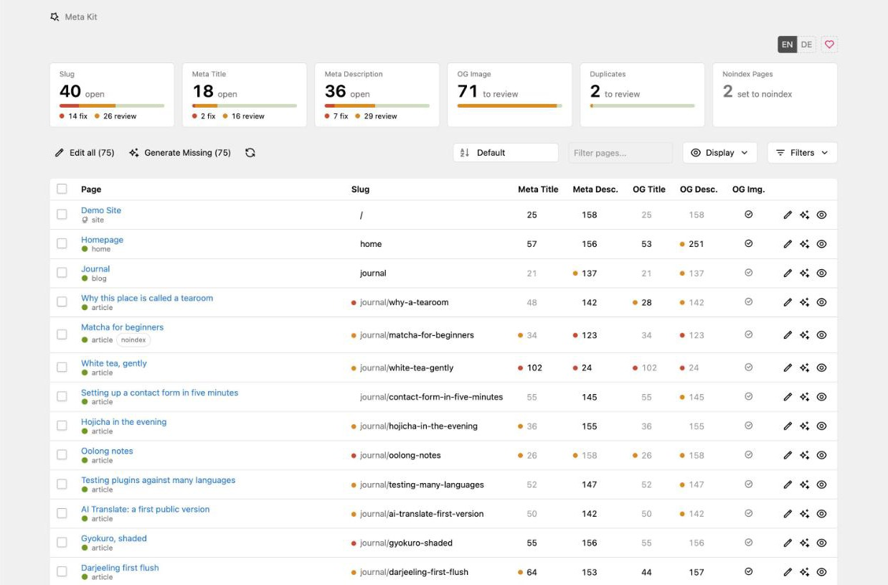

# Kirby Meta Kit

An SEO workflow plugin for Kirby CMS: one Panel area for all metadata, validation that shows what to fix, AI generation that follows your rules, previews, sitemap, robots.txt and structured data.

[](https://github.com/tearoom1/kirby-meta-kit)

## What you get

- **One place for metadata.** A Meta Kit area in the Panel lists every page with its meta title, description, Open Graph fields and image. Edit one page or many in dialogs, filter by what needs attention.
- **Validation that explains itself.** Length ranges for titles, descriptions and slugs, global or per template. Only problems get a mark: orange to review, red to fix. Site name appending is part of the title length.
- **AI that follows your rules.** Generate titles and descriptions that match your ranges, in the current language. OpenRouter (free tier available), Mistral (EU) or any OpenAI-compatible API. Generated texts are reviewed before anything is saved. Optional: an experimental content review per page.
- **Previews.** Google, Facebook and Twitter cards in the page editor.
- **Everything in the head.** One snippet outputs meta tags, canonical, robots, Open Graph, Twitter Cards, hreflang and Schema.org JSON-LD.
- **Sitemap and robots.txt.** A styled multilingual sitemap with priorities, a dynamic robots.txt with bad bot and AI crawler blocking, redirects after slug changes, llms.txt.
- **Multilingual and Kirby 5.** Works with language fallbacks and inherited values, Panel in English and German, dark mode.

## Installation

### Via Composer (Recommended)

```bash
composer require tearoom1/kirby-meta-kit
```

### Manual Installation

1. Download and extract to `site/plugins/meta-kit`
2. Get a free API key from [OpenRouter.ai](https://openrouter.ai/) (optional, for AI features)

## Quick Start

### 1. Add SEO Snippet

Add this single line to your template's `<head>` section:

```php
<head>
    <?php snippet('meta-kit/seo') ?>
    <!-- Your other head content -->
</head>
```

This snippet automatically includes:
- All meta tags (title, description, robots, canonical, keywords)
- OpenGraph and Twitter Card tags
- Schema.org JSON-LD structured data
- Hreflang tags for multilingual sites

### 2. Extend Blueprints

**Site Settings** (`site/blueprints/site.yml`):
```yaml
tabs:
  seo:
    extends: meta-kit/site
```

**Page SEO** (`site/blueprints/pages/default.yml`):
```yaml
tabs:
  seo:
    extends: meta-kit/page
```

### 3. Configure Basic Settings

Add to `site/config/config.php`:

```php
return [
    'tearoom1.meta-kit' => [
        // Optional: Add AI features
        'api.key' => 'sk-or-v1-YOUR-KEY',
        'api.model' => 'google/gemma-4-31b-it:free',
    ]
];
```

That's it! You now have:
- ✅ SEO metadata fields in your pages
- ✅ Site-wide SEO settings
- ✅ Automatic sitemap at `/sitemap.xml`
- ✅ Dynamic robots.txt at `/robots.txt`
- ✅ (Optional) AI-powered content generation

## Configuration

Two layers: technical settings in `site/config/config.php`, content defaults in the Panel under **Site → SEO & Social Media** (default title and description, title separator, site name appending, AI provider and model, social profiles, sitemap and robots.txt). Config values win over Panel values.

The options you will most likely touch:

```php
'tearoom1.meta-kit' => [
    'api.provider' => 'openrouter',   // 'openrouter', 'mistral' or 'custom'
    'api.key' => 'sk-or-v1-YOUR-KEY',
    'api.model' => 'google/gemma-4-31b-it:free',
    'ai.enabled' => true,             // false hides every AI feature
    'review.enabled' => false,        // opt-in: experimental AI content review
    'allowedRoles' => [],             // roles besides admin that may use Meta Kit
    'excludeTemplates' => [],         // templates hidden from the Panel table
    'validation' => [],               // length ranges, see Validation
    'sitemap.enabled' => true,
    'robots' => ['enabled' => true, 'blockBadBots' => true, 'blockAiCrawlers' => false],
    'redirects.enabled' => true,
    'llms.enabled' => false,
]
```

Only admins see Meta Kit unless you list other roles in `allowedRoles`. Full details, every option and the Panel tabs: [docs/configuration.md](docs/configuration.md)

## Validation

Every title and description gets a length range: green inside the optimal range, orange inside the warning range, red outside. Slugs are checked for depth, word count and length. Title lengths include the appended site name.

| Field | Optimal | Still acceptable |
|---|---|---|
| Meta title | 20 to 60 | 15 to 75 |
| Meta description | 140 to 160 | 126 to 176 |
| OG title | 20 to 60 | 15 to 75 |
| OG description | 150 to 250 | 135 to 300 |

Override globally or per template; partial rules keep the rest of the defaults:

```php
'validation' => [
    'ranges' => ['title' => ['optimal' => ['min' => 30, 'max' => 60]]],
    'templates' => [
        'article' => ['title' => ['optimal' => ['min' => 40, 'max' => 70]]],
    ],
]
```

Slug rules and the reasoning behind the ranges: [docs/validation.md](docs/validation.md)

## AI Generation and Review

Set `api.key` and `api.model` and every title and description field gets a generate button. The AI reads the page text, writes in the current language and formality, and keeps to the validation ranges of that template. In the Meta Kit area, **Generate Missing** fills empty fields for the selected or filtered pages, page by page with progress and cancel, and shows the texts for review before anything is saved.

- **Providers**: OpenRouter (default, free tier), Mistral (EU data processing), or any OpenAI-compatible endpoint via `api.provider => 'custom'` and `api.endpoint`
- **Tuning**: `api.temperature`, `api.reasoning` for reasoning models, `ai.tone` formal or informal, custom prompts per field
- **Content review** (experimental, `review.enabled => true`): an editorial verdict per page with keyphrases, strengths, problems and next steps, in the Meta Kit table and as an `mk-review` field in page blueprints
- **Off switch**: no key, no model, or `ai.enabled => false`

Providers, model list, prompts and the review field: [docs/ai.md](docs/ai.md)

## Panel Interface

The **Meta Kit** area in the main menu lists every page with slug, meta title, meta description, OG title, OG description and OG image.

- **Tiles** per area show what is open, split into fix and review. Click one to filter the table.
- **Table**: only problems get a dot, orange to review and red to fix. Inherited values are dimmed; the Display menu switches between hiding them, dimming them, or writing the source beneath (Title, Meta, Site, main language). Hover a value for the text, a length meter and the source.
- **Edit** and **Generate Missing** act on the selected pages, or on all filtered pages when nothing is selected. The button says which.
- **Dialogs** for one page or many, with a length meter under every field and an AI button per field.
- **Display** remembers view, inheritance and page size per browser; filters, search and sort stay for the tab.

The **SEO tab** in the page editor (`extends: meta-kit/page`) adds slug info, meta and OG fields with live counters, robots, canonical URL and Google, Facebook and Twitter previews. More: [docs/panel.md](docs/panel.md)

## Sitemap, robots.txt, Redirects, llms.txt and Schema.org

- `/sitemap.xml`: all published pages, hreflang for every language, priorities and change frequencies per template, page images, styled for humans, cached and cleared on every content change. Exclude pages in the Panel or with `sitemap.exclude`.
- `/robots.txt`: generated with sitemap reference, bad bot blocking, optional AI crawler blocking, and custom rules from the Panel under Site → Robots.txt.
- **Redirects**: when a slug changes or a page moves, the old path and all subpaths redirect with 301 to the page's new URL. Listed and editable under Site → SEO & Sitemap → Redirects.
- `/llms.txt`: optional Markdown overview for AI assistants, off by default.
- **Schema.org**: Organization, WebSite, WebPage with breadcrumbs and Article markup as JSON-LD, all from the one snippet.

Every toggle and the article fields: [docs/sitemap-robots.md](docs/sitemap-robots.md)

## For Developers

```php
$page->metaTitle()->value();            // the stored fields
$page->ogImage()->toFile();
$page->generateSeoTitle();               // AI generation from code
$page->generateSeoDescription($text, 'de');
$page->text()->toSeoDescription();       // any field to an SEO text
```

```bash
POST /api/meta-kit/generate   # {"text": "...", "language": "de", "pageId": "...", "fieldType": "description"}
```

Page methods, endpoints, custom templates and troubleshooting: [docs/developers.md](docs/developers.md). Habits that keep metadata in good shape: [docs/best-practices.md](docs/best-practices.md)

## Requirements

- **PHP**: 8.1 or higher
- **Kirby**: 5.0+
- **Composer**: For dependency management
- **AI Provider API Key**: Optional, only needed for AI features (OpenRouter has a free tier)

## License

This plugin is licensed under the [MIT License](LICENSE.md).

## Credits

**Developed by:** Mathis Koblin

**Special Thanks:**
- The Kirby CMS team for an excellent platform
- OpenRouter for affordable AI API access
- The Kirby community for feedback and support

## Support & Feedback

- **Issues and Suggestions**: [GitHub Issues](https://github.com/tearoom1/kirby-meta-kit/issues)
- **Documentation**: the [docs](docs/) folder and inline code comments
- **Support Policy**: Support is limited to public GitHub Issues. Email support, consulting, and guaranteed response times are not included.

Meta Kit is fully MIT-licensed — no paywalls, no feature gates. If it saves you time and you want to keep it healthy, sponsorships are the best way to support continued development:

- [GitHub Sponsors](https://github.com/sponsors/tearoom1)
- [Buy Me a Coffee](https://buymeacoffee.com/tearoom1)

[](https://buymeacoffee.com/tearoom1)
